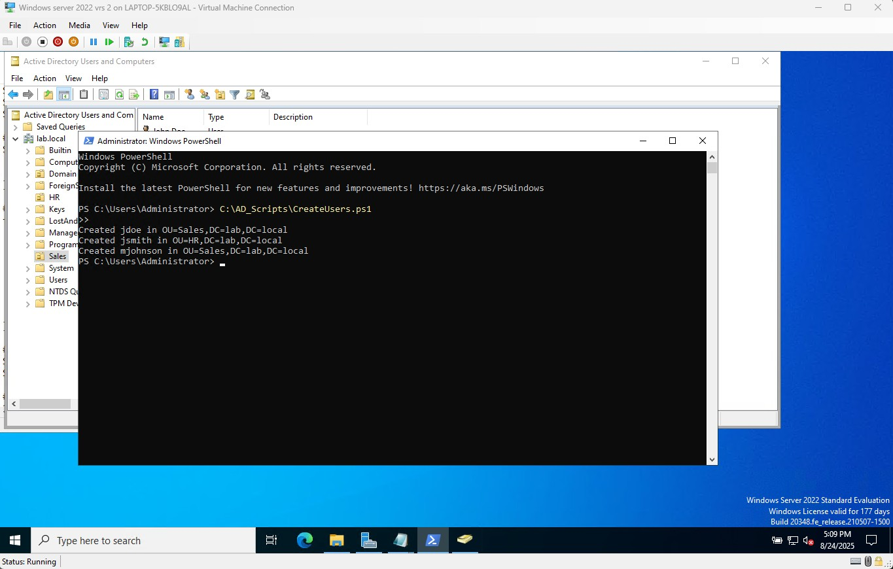

# 🖥️ Active Directory User Provisioning Lab

> A Windows Server 2022 lab project demonstrating **bulk Active Directory user provisioning** with PowerShell.  
> Users are automatically placed into the correct **Organizational Units (OUs)** and **Security Groups** based on their department.

---

## ✨ Features

- 🚀 **Bulk provisioning** of users from CSV  
- 🗂️ Department → OU mapping (e.g., Sales, HR)  
- 👥 Auto-create and enforce **group membership** (SalesGroup, HRGroup)  
- 🔒 Accounts enabled with **first-login password reset** policy  
- ♻️ **Idempotent**: moves existing users to the right OU if needed  
- 📜 Script includes **dry-run mode** for safe testing

---

## 🛠️ Requirements

- Windows Server 2022 with **Active Directory Domain Services** (AD DS) + DNS installed  
- **Active Directory PowerShell Module** (`Import-Module ActiveDirectory`)  
- Run script as a **Domain Admin** inside the lab environment  

---

## 📂 Project Structure

```text
AD-Lab/
├── CreateUsers.ps1        # Main automation script
├── CreateUsers.DryRun.ps1 # Dry-run version (no changes, just WhatIf)
├── NewUsers.csv           # Sample users (fake data)
└── README.md              # Documentation
```

📊 Usage
Clone this repo or download the scripts.

Update NewUsers.csv with your test users:

FirstName,LastName,UserName,Password,Department
John,Doe,jdoe,Passw0rd123,Sales
Jane,Smith,jsmith,Passw0rd123,HR
Mark,Johnson,mjohnson,Passw0rd123,Sales

Run the script from PowerShell as Administrator:

.\CreateUsers.ps1 
Verify results: 

Get-ADUser jdoe -Properties CanonicalName 
Get-ADGroupMember SalesGroup 
Get-ADGroupMember HRGroup 
📸 Screenshots 
Users provisioned into correct OUs 


PowerShell verification

🧩 Example Output

Created jdoe in OU=Sales,DC=lab,DC=local 
Created jsmith in OU=HR,DC=lab,DC=local 
Created mjohnson in OU=Sales,DC=lab,DC=local 
